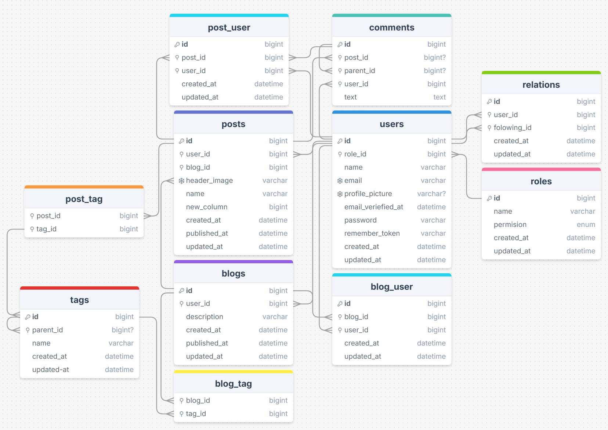

# Changelog

## [0.0.2] - 2025-10-15

### Updated

- Users
    - role_id
    - Default role_id
- Blogs
    - user_id
- Posts
    - user_id
    - blog_id

### Added

- Roles
    - Model
    - Controller
    - Seeder
- Blogs
    - Model
    - Controller
- Posts
    - Model
    - Controller
- Middleware
    - Admin check

## [0.0.2] - 2025-10-14

### Updated

- ERD
  

### Added

- ERD
    - Post_User Table
    - Blog_User Table
    - Relations Table

- Roles
    - Model
    - Migration
    - Request
    - Controller
    - Policy

### Removed

- ERD
    - Likes Table
    - Images Table

## [0.0.1] - 2025-10-13

### Added

- User Stories
    - Log in
    - Blog creation
    - Post creation
    - Comment creation
    - Admin dashboard
    - Blog confirmation

- ERD
    - User Table
    - Images Table
    - Blog Table
    - Posts Table
    - Comments Table
    - Tags Table
    - Likes Table

### Updated

- User Table

# Template

## [0.0.0] - yyyy-mm-dd

### Added

- list

### Changed

- list

### Removed

- list

### Fixed

- list
